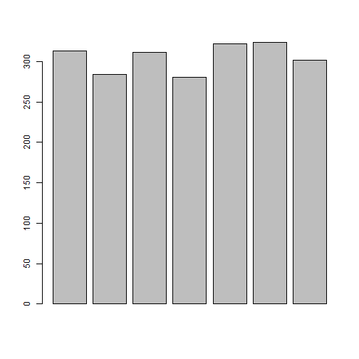

# assignment1


###Question: 1) no. of KM travelled before each stop
####Answer

```r
r <- diff(65311,65624,65908,66219,66499,66821,67145,67447)
```
###Question: 2) total number of KMs travelled 
####Answer 

```r
total_kms_travld <- sum(r) 
total_kms_travld
```

```
## [1] 0
```
### Question: 3) total number of KMs travelled using min() and max()
####Answer 

```r
mini <- min(r)
```

```
## Warning in min(r): no non-missing arguments to min; returning Inf
```

```r
maxi <- max(r)
```

```
## Warning in max(r): no non-missing arguments to max; returning -Inf
```

```r
total_travelld <- maxi - mini 
total_travelld
```

```
## [1] -Inf
```
# Question: 4) total number of KMs travelled using indices of vector
## Answer

```r
mi <- r[1]
mx <- r[length(r)]
tot <- mx - mi 
tot
```

```
## numeric(0)
```
# Question : 5) total number of KMs travelled using rev()
## Answer

```r
a <- rev(r)
sum(a)
```

```
## [1] 0
```

# total number of KMs travelled using head() and tail()

```r
x <- head(r)
y <- tail(r)
tot_h_t <- x+y
```
# total number of KMs travelled using head() and rev()

```r
x <- head(r)
y <- rev(r)
tot <- x+y
tot
```

```
## numeric(0)
```

```r
barplot(r)
```

```
## Warning in min(w.l): no non-missing arguments to min; returning Inf
```

```
## Warning in max(w.r): no non-missing arguments to max; returning -Inf
```

```
## Warning in min(x): no non-missing arguments to min; returning Inf
```

```
## Warning in max(x): no non-missing arguments to max; returning -Inf
```

```
## Error in plot.window(xlim, ylim, log = log, ...): need finite 'xlim' values
```


